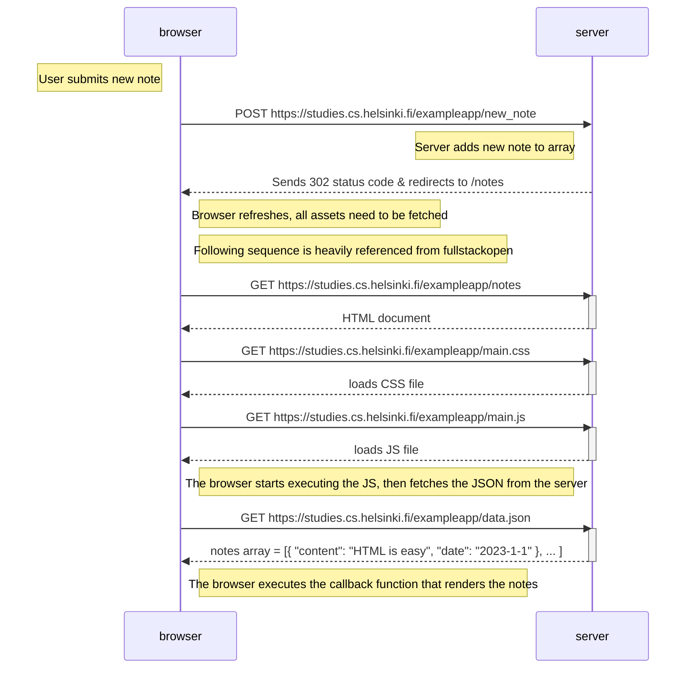

```mermaid
sequenceDiagram
    participant browser
    participant server

    Note left of browser: User submits new note
    browser->>server: POST https://studies.cs.helsinki.fi/exampleapp/new_note

    Note left of server: Server adds new note to array
    server-->>browser: Sends 302 status code & redirects to /notes

    Note right of browser: Browser refreshes, all assets need to be fetched
    
    Note right of browser: Following sequence is heavily referenced from fullstackopen
    
    
    browser->>server: GET https://studies.cs.helsinki.fi/exampleapp/notes
    activate server
    server-->>browser: HTML document
    deactivate server

    browser->>server: GET https://studies.cs.helsinki.fi/exampleapp/main.css
    activate server
    server-->>browser: loads CSS file
    deactivate server

    browser->>server: GET https://studies.cs.helsinki.fi/exampleapp/main.js
    activate server
    server-->>browser: loads JS file
    deactivate server

    Note right of browser: The browser starts executing the JS, then fetches the JSON from the server

    browser->>server: GET https://studies.cs.helsinki.fi/exampleapp/data.json
    activate server
    server-->>browser: notes array = [{ "content": "HTML is easy", "date": "2023-1-1" }, ... ]
    deactivate server

    Note right of browser: The browser executes the callback function that renders the notes
```
