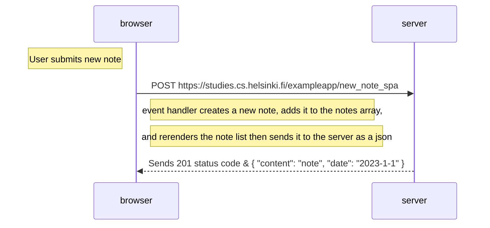

```mermaid
sequenceDiagram
    participant browser
    participant server

    Note left of browser: User submits new note
    browser->>server: POST https://studies.cs.helsinki.fi/exampleapp/new_note_spa

    Note right of browser: event handler creates a new note, adds it to the notes array,
    Note right of browser: and rerenders the note list then sends it to the server as a json

    server-->>browser: Sends 201 status code & { "content": "note", "date": "2023-1-1" }
    
```